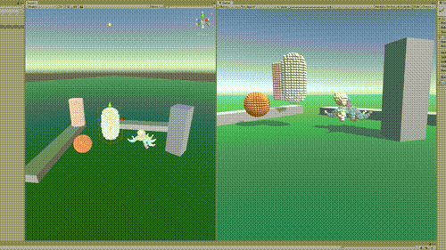

# VR-Physics-Integration
## Description 
A Virtual Reality scenario where a particle physics engine is used to emulate soft/deformable bodies, liquids, clothes and ropes.

### Topics:
- VR Virtual-Reality 
- Physics Simulation

## Result

## Requirements & Dependencies
- Unity 2021.3
- HTC Vive

## Install / Run
*   clone the repository
*   open with UnityHub
*   connect your device
*   run the app

## Useful Resources & Extra
- Links
  - https://developer.nvidia.com/flex
  - https://github.com/NVIDIAGameWorks/FleX
- Resources

## Authors
* **Igor Lirussi** @ BOUN Boğaziçi University - BuViar Lab

## Acknowledgments
*   All the people that contributed with suggestions and tips.

## License
This project is licensed - see the [LICENSE](LICENSE) file for details.
